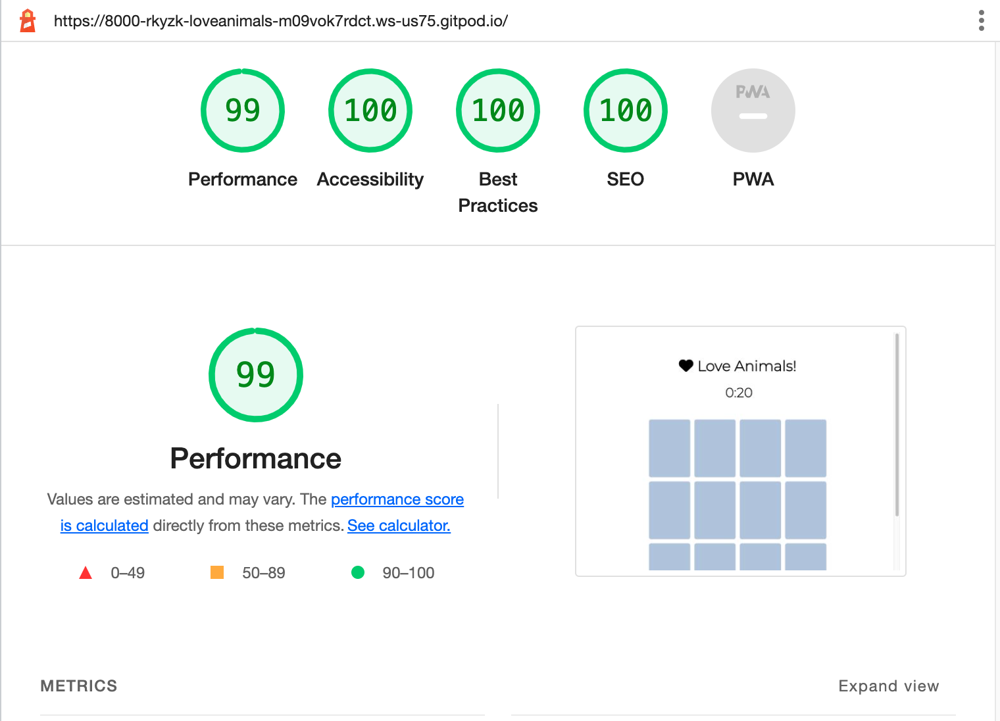

# 動物大好き！

神経衰弱（メモリーゲーム）です。20秒の間にマッチするペアを探しましょう。
一つペアを見つけるごとに画面下の星が一つずつ黄色くなります。

デプロイしたプロジェクトはこちら: [動物大好き!](https://rkyzk.github.io/love-animals/)
---
# Love Animals!

## Description: 
"Love Animals" is a memory game with 12 cards with animal and tree images.  
Users have 20 seconds to complete the game. Each time the page loads, 
the cards will be shuffled in a new order. Users can train their memory while having fun. 

The live link to the website: [Love Animals!](https://rkyzk.github.io/love-animals/)

## Technologies used: 
* HTML/CSS and JavaScript

## Features
* Existing Features
- Header  
At the top of the page, the header shows a heart icon and the game title "Love Animals!"
This offers a friendly invitation to users to play the game.

- Timer  
Below the header a timer is set to 20 seconds and counts down.  
When it hits zero, a message saying "Time's up" appears in red letters.
The timer urges users to proceed with the game as fast as possible.    

- Cards  
12 cards are placed in the section, and initially the back sides are faced up.
When users bring the mouse over a card, the color turns darker so that it's clear
which card the mouse is hovering over.
When users click on a card, it flips the side and shows an animal or tree image. 
When two cards have been flipped, the function to flip the rest of the cards is disabled
temporarily until the two flipped cards have been checked. 
If the two cards match, they disappear after half a second.
If the two cards don't match, they are flipped back after a second.
I used a light blue color for the back sides of the cards and a beige color for the background 
of the images.  
I selected these colors because the contrast makes the two sides clearly distinguishable and also because the images will stand out against the light colors.  

- Stars  
Each time users identify a matching pair, one of the stars placed below the cards turns from grey to yellow.

- At the end of the game 
If users complete the game within 20 seconds, the screen will dispaly a reward message, 
graphics of the savanna forest and a reset button, saying "Play again."
Clicking on the reset button will reload the page to display a new game.
If 20 seconds are over before users finish the game, a message saying "Time's up" and
a reset button will be displayed. In addition the function to flip the cards will be disabled from the remaining cards.
  
## Accessibility and Performance 

I tested playing this game in different browsers: Chrome, Safari and Firefox. 
I tested that the game runs fine. 
I confirmed that all items are displayed clearly, and it's clear for readers how to play the game.   
I confirmed that the colors and fonts chosen are easy to read and accessible by running it through lighthouse in devtools. 

## Bugs 

### Solved bugs
Earlier, if I complete the game right before the time is up, the message "Time's up" would appear 
for a short while before the correct message "well done" appeared.
I changed line 210-215 in the javascript file and delayed the appearance of "Time's up" message 
so as to avoid such instances as mentioned above.  

### Validator Testing 
* HTML
No errors were returned when passing through the official W3C validator

* CSS
No errors were found when passing through the official (Jigsaw) validator

### Unfixed Bugs 
No unfixed bugs

## Deployment
The site was deployed to GitHub pages.  
The steps to deploy: 
* In the Github repository, click on the Settings tab.
* Click on “Pages” in the left column.
* Under “Build and deployment,” select “deploy from a branch,” “main” and “/root” as in the photo below.
* Then the link to the website will appear on the top of the page. 

## Credits
### Media
* Font Montserrat was imported from Google Fonts.
* All images (animals, tree and the savanna forest) were downloaded from the link below:

https://www.vecteezy.com

* The heart icon was imported from fontawesome.

* The shuffle function in script.js (47-61) was taken from https://stackoverflow.com/questions/2450954/how-to-randomize-shuffle-a-javascript-array
