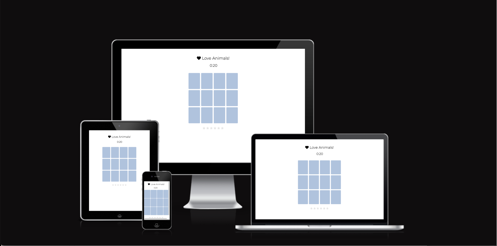

# Love Animals!

## Description: 
"Love Animals" is a memory game with 12 cards with animal and tree images.  
Users have 20 seconds to complete the game.
For each pair 

* On the web pages, the users can see various photos of the garden and get information about the events as well as directions to the garden. The contact page offers a form, with which the users should be able to sign up for the events, or send messages to the personnel. The input data will not be sent to a database, but the function will be implemented in the future.

## Technologies used: 
HTML and CSS

## Features
**Navigation (Common for all three pages)**

* The navigation shows the name of the garden in the left corner: Freiburg Kappel Organic Garden, which links to the top of “Home” page. 
* Just below that, the navigation menu is placed, offering links to different pages: Home, Events and Contact.  
* The dark blue color of the menu makes the white letters easily readable.  
* The navigation clearly tells the name of the website, which is also the name of the garden.  
* The titles of all three pages are clearly defined so the users can easily access the information they need.     

### "Home" page
**Welcome section**

* Welcome section offers a welcome message, invites the audience to visit the place and provides them with a general overview of the garden.
* Flower icons are used next to the title of the section (in other sections and paragraphs as well).  These icons make the page visually more enjoyable.    

**Join us section**

* The title and the one-line introduction call the audience to participate in the events at the garden. 
* The section presents important information about two upcoming events.
* The descriptions are accompanied by photos that give the users the feel for the events.
* At the end of each description, a link to “Contact” page is placed, where the users can sign up for the events or write to the personnel.  
* Then comes another link to “Events” page, where the users can see what events are held at the garden throughout the year. 
* At the bottom of the section, additional photos show the audience what the garden is like.  

**Where we are section**

* The section shows a map imported from google map and the address of the garden as well as directions, all of which are valuable for those who plan to visit the place.    

**Footer (common for "Home" and "Events" pages)**

* The footer offers links to social networks: Facebook, Twitter and Instagram.
* A floral graphic is applied as decoration, adding an elegant style to the page. 

### "Events" page 

* The page includes a table where the events at the garden are listed in the calendrical order.
* This list is valuable since it informs the users about the events held at the garden throughout the year.   
* Four photos of different flowers cropped in circle are placed as decorations.   
* These photos are also valuable as the audience can see what beautiful flowers the garden has to offer.   

### "Contact" page

* The page contains a form, with which the users can sign up for events or simply write to the personnel.  
* The form collects users’ first names, last names, emails, their options for which event(s) they want to sign up for (optional) and/or comments (optional).
* The form is important as it allows the users to sign up for the events or to contact the personnel.   
* On this page, I made a dark background for the logo in order to make a sufficient contrast.
* For the background of the form, I used a dark gray color so that the white letters on the form are easily readable. 
* By using the dark gray color I also intended to avoid interfering with the colors in the surrounding image.  I made the gray color somewhat transparent so the audience can still see through the flowers.  

## Testing 
* I checked that these pages work well in different browsers: Chrome, Safari and Firefox.
* I tested that these pages are responsive and that they are displayed fine and function well in all standard screen sizes by using the devtools device toolbar.  
* I confirmed that all texts on the pages are easily readable and understandable.  
* I tested that all links lead to the destinations as indicated.  
* As for the form on “Contact” page, I tested that a message would instruct the users to fill out required fields (first name, last name and email), if those fields are left empty.  If a text without “@” sign is entered for the email, another pop-up tells them to correct the input. 

## Bugs 
No validation messages showed up for the form. 
I fixed it by changing the value of the type attribute in the input tag in line 56 of contact.html from “button” to “submit.” 

## Unfixed bugs 
The radio buttons in contact.html can't be undone if once selected.  This can't be fixed with HTML and CSS.  In the future I'll use jquery or JavaScript to fix this bug.  

## Validator Testing
### HTML
The following errors were found with the official W3C validator and were corrected:
* Some id names were used twice for different tags, so I made unique ids for those tags. 
* id attributes were missing in input tags in contact.html, so I added them.
* There were improper line breaks in the value of the source attribute in iframe tag.  I put the value in one line (line 92 in index.html.)

### CSS
* No errors were found by the official (Jigsaw) validator.     

## Accessibility and Performance 
The following items were pointed out by lighthouse in devtools and were corrected:
* I changed the color of the submit button in contact.html in order to make the letters easily readable. 
* I added "title" property in the iframe tag.
* I changed h3 text to h2 in line 30 in contact.html ir order to have heading elements in a sequentially descending order.  

## Deployment
The site was deployed to GitHub pages.  
The steps to deploy: 
* In the Github repository, click on the Settings tab.
* Click on “Pages” in the left column.
* Under “Build and deployment,” select “deploy from a branch,” “main” and “/root” as in the photo below.
* Then the link to the website will appear on the top of the page. 
* the live link to the website: [Freiburg Kappel Organic Garden](https://rkyzk.github.io/freiburg-kappel-organic-garden/)

## Credits
### Content
* Some suggestions were given by my mentor Jubril Acolade.
Accordingly, I made the color contrast between the background and the letters stronger, and I implemented set values for widths and heights of some images.  
* The code of social media links was taken from Code Institute’s Love Running Project.

### Media
* Font Lato was imported from Google Fonts.
* The three photos on "Home" page (the compost pile, a hand planting bulbs and a girl watering a red tulip) were downloaded from Shutterstock (All other photos used in this project were taken by myself.) 

    https://www.shutterstock.com/ja/image-photo/little-girl-posing-red-watering-can-104304419

    https://www.shutterstock.com/ja/image-photo/womens-hand-soilsoil-flower-bulbs-close-655746205

    https://www.shutterstock.com/ja/image-photo/person-building-permaculture-hill-mound-using-1858739254

* The three flower icons on "Home" page (the one next to section titles and the two icons placed on both sides of the titles in the events descriptions) were taken from Freepik: 

    https://www.freepik.com/free-vector/hand-drawn-flower-set_4089974.htm#query=flower%20graphic&position=40&from_view=search

* The sitemap was taken from Google Map.
* The social network icons (Facebook, Twitter and Instagram) were taken from Font Awesome.
* The floral graphic in the footer was taken from Freepik:

    https://www.freepik.com/free-vector/hand-drawn-monoline-floral-decorative-elements-background_24858693.htm#query=black%20white%20graphics%20flower&position=5&from_view=search